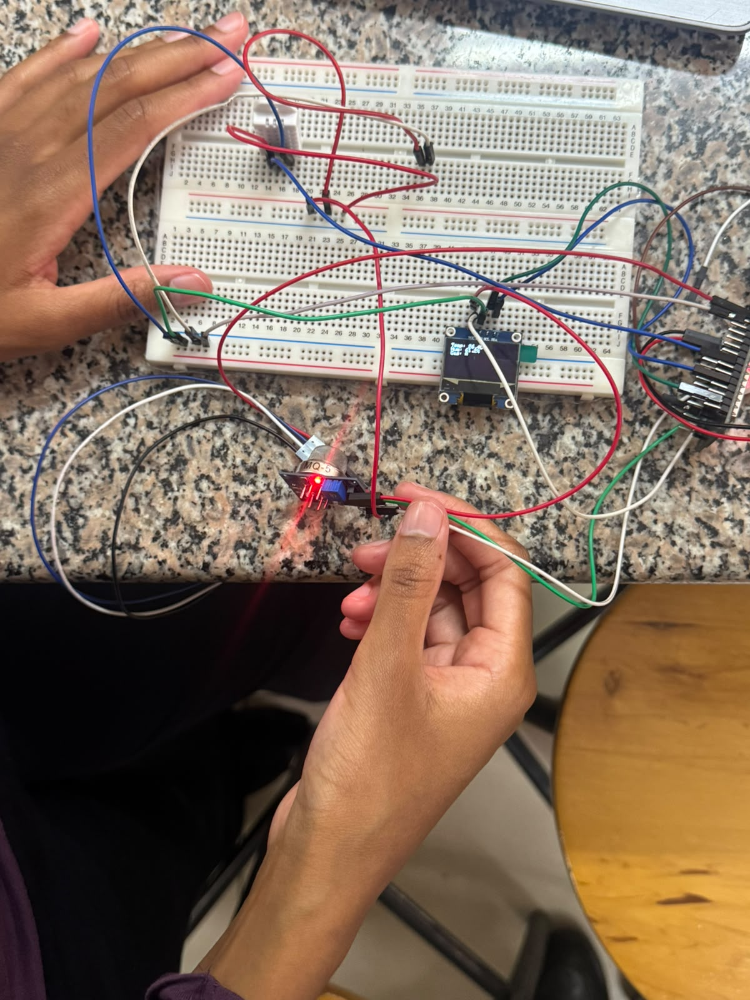
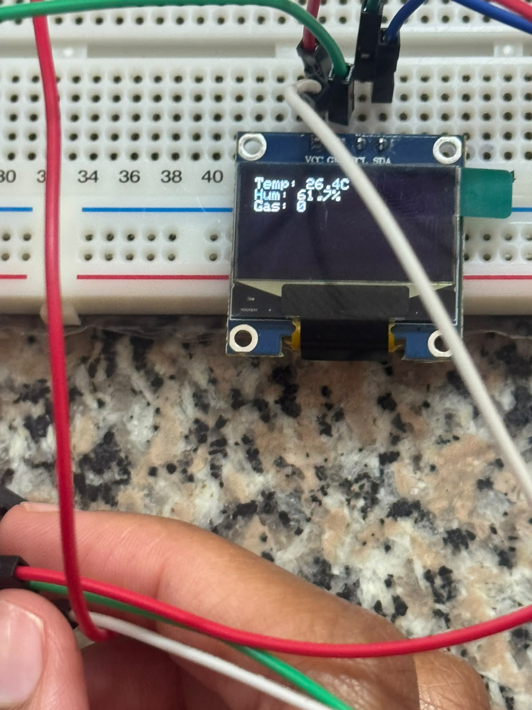
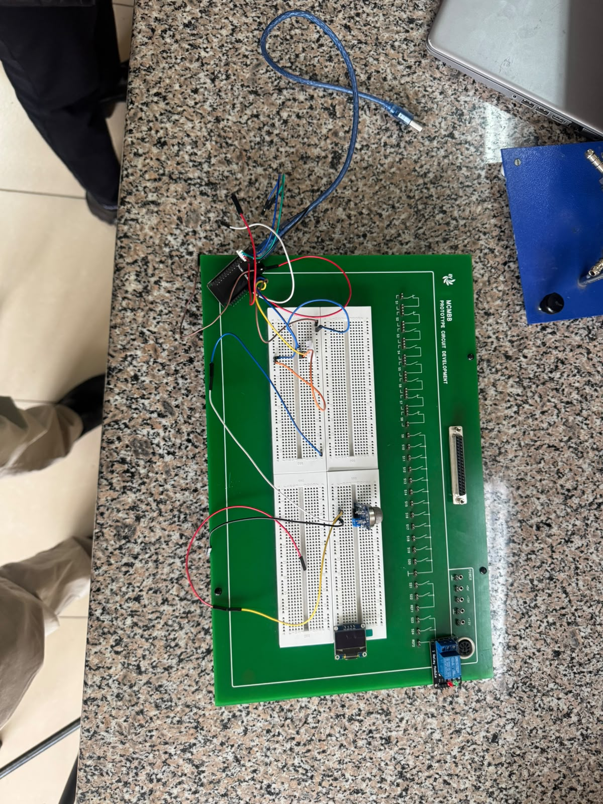
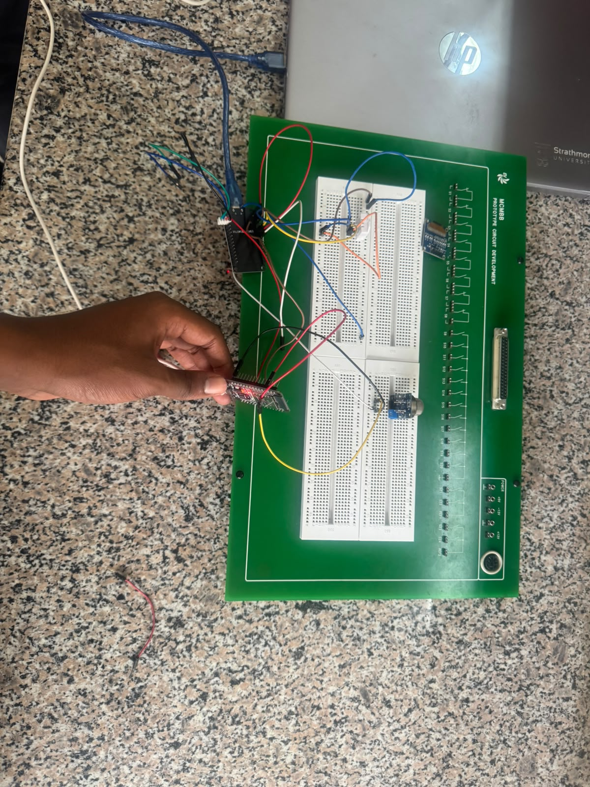
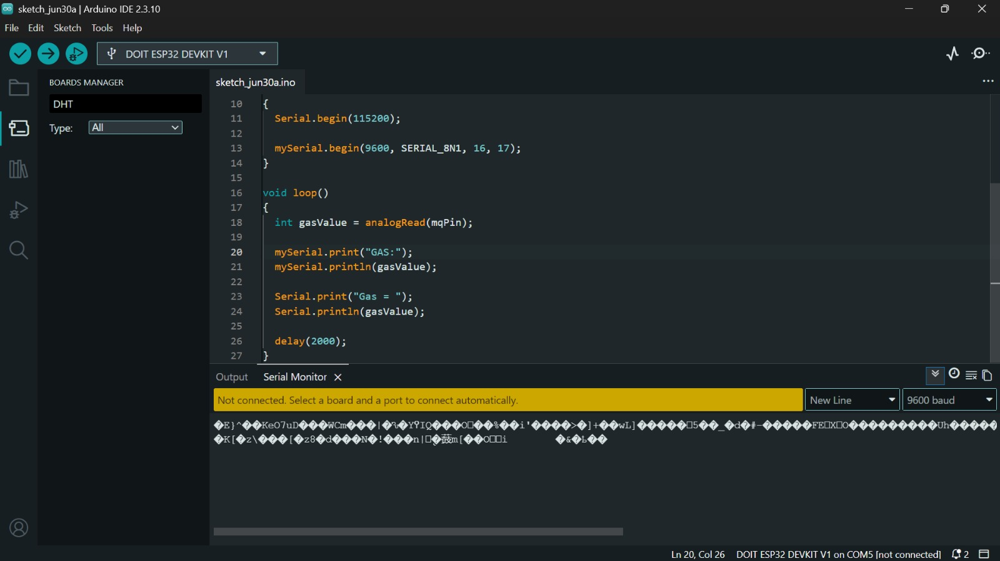

# ICS 4111: Embedded Systems & IoT
# Semester Project: Deliverable 2

## Project: Flora Farms Remote Greenhouse Monitoring System
## Assigned Flower: Daisy

---

## 1. Project Implementation Overview

Following the successful completion of our system planning phase in Deliverable 1, this deliverable transitions the schematic blueprints of the Flora Farms remote greenhouse monitoring system into functional, evaluable prototypes. Operating under the specific environmental parameters required (*Bellis perennis*), our deployment targets real-time collection of temperature, relative humidity, and gas data.

In line with the requirements of Semester Project Deliverable 2, our group constructed four prototypes in total combining physical implementations with simulated instances using wokwi to evaluate system scalability and fault tolerance across architectures.

---

## 2. Prototype Hardware Architecture

### 2.1 Prototype Configuration Table

| Parameter | Details |
| --- | --- |
| **Architecture A** | 1 ESP32S connected to 1 MQ-5, 1 DHT22, and 1 LCD. Deployed as both a physical prototype and a Wokwi simulation. |
| **Architecture B** | 2× ESP32S — one interfaced with the MQ-5 and the other with the DHT22 — connected directly to each other via serial communication. Deployed as a physical hardware assembly. |
| **Architecture C** | 2× ESP32S — one interfaced with the DHT22 and the other with the MQ-5 — connected to each other through an isolating relay. Deployed as a simulated Wokwi model. |

---

## 3. Detailed Component Deployment

### 3.1 System Implementation Matrix

| Component Architecture | Implementation Medium | System Target and Purpose | Deployment Status |
| --- | --- | --- | --- |
| **Architecture A** | Physical breadboard & simulated Wokwi | Centralized single-node monitoring of temperature, humidity, and gas leakage, with local LCD rendering. | **Fully Functional** — local LCD output active; Wokwi simulation deployed. |
| **Architecture B** | Physical breadboard assembly | Distributed master-slave processing across 2 ESP32S boards via hardwired RX/TX cross-serial data transfer. | **Documented** — hardware setup complete; physical serial faults isolated. |
| **Architecture C** | Cloud-hosted Wokwi simulator | Isolated multi-node processing across 2 ESP32S boards using an optocoupler-driven 5V low-level trigger relay. | **Fully Functional** — logic verified via public simulation model. |

---

## 4. Simulation & Physical Hardware Specifications

### 4.1 Architecture A: Centralized Monitoring Node

- **Structural Overview:** A single ESP32S DevKit acts as the central controller for the greenhouse workspace, reading analog voltage from the MQ-5 sensor and single-wire serial data from the DHT22.
- **Local Interface Output:** Sensor data is rendered locally on an SH1106-driven 1.3" OLED display via I²C (SDA/SCL).
- **Reference Link:** [Wokwi URL for Architecture A](https://wokwi.com/projects/467656267856992257)

### 4.2 Architecture B: Cross-Serial Dual-MCU Subsystem

- **Structural Overview:** Uses 2 ESP32S boards, each handling a separate sensor. Node 1 handles the MQ-5 (SnO₂) gas-sensing circuit, and Node 2 handles the DHT22 microclimate readings.
- **Inter-Device Interfacing:** Cross-connected UART channels route Node 1's output directly into Node 2's receiver pins.
- **Reference Link:** Physical layout documented in Section 5 (Diagnostics Log).

### 4.3 Architecture C: Relay-Isolated Dual-MCU Subsystem

- **Structural Overview:** Uses 2 independent ESP32S modules separated by a 5V single-channel low-level trigger relay, preventing electrical noise propagation between the higher-draw sensor sub-circuits.
- **Inter-Device Interfacing:** The DHT22-driving MCU activates the relay coil by pulling the logic line LOW (0–1.5V), opening or closing the data path to the MQ-5 subsystem.
- **Reference Links:**
  - [Wokwi URL — simulatable version](https://wokwi.com/projects/468326525605797889)
  - [Wokwi URL — intended 2-ESP32S structure](https://wokwi.com/projects/468143398278605825)

---

## 5. Prototyping Diagnostics & Troubleshooting Log

### 5.1 Architecture B Technical Analysis

As documented in our team's coordination logs, the physical deployment of Architecture B presented hardware debugging challenges prior to submission.
```
[ Hardware Code Compilation and Firmware Upload: SUCCESSFUL ]
[ Serial Data Output: CORRUPTED / INVALID CHARACTERS ENCOUNTERED ]
```

### 5.2 Problem Description

Code compiled and uploaded cleanly to both microcontrollers, but real-time metrics failed to populate legibly on the IDE serial monitor. The incoming bitstream appeared as unstructured garbage values, making data validation impossible.

### 5.3 Root Cause Analysis

Investigation into the physical breadboard setup identified two likely contributing faults:

- **Component-Level Vulnerabilities:** Minor hardware issues introduced instability along baseline electrical connections.
- **Serial Transmission Desynchronization:** Mismatched timing or baud rates likely corrupted the TX/RX data stream before it reached the host terminal.

### 5.4 Solutions Explored

The team worked through the following interventions to resolve the transmission failure:

1. **Cloud IDE Deployment:** Migrated the compilation pipeline to a cloud-hosted IDE to rule out local software/environment issues.
2. **Silicon Testing:** Swapped in alternative ESP32S boards to confirm the original units weren't defective.

---

## 6. Circuit Implementation Media

### 6.1 Physical Bench Visuals & LCD Outputs

**Architecture A**





**Wokwi Link:** [Wokwi URL for Architecture A](https://wokwi.com/projects/467656267856992257)

**Architecture B**







**Architecture C**

**Wokwi Links:**
- [Wokwi URL — simulatable version](https://wokwi.com/projects/468326525605797889)
- [Wokwi URL — intended 2-ESP32S structure](https://wokwi.com/projects/468143398278605825)

### 6.2 Evidence of Group Work

Consistent with the group's workflow from Deliverable 1, technical troubleshooting, driver adjustments, and simulation reviews were coordinated collectively during virtual sessions by Scott, Samuel, Alysa, Abraham, Fatuma, and Nicole. As documented below, physical implementation was reviewed transparently as a group.

